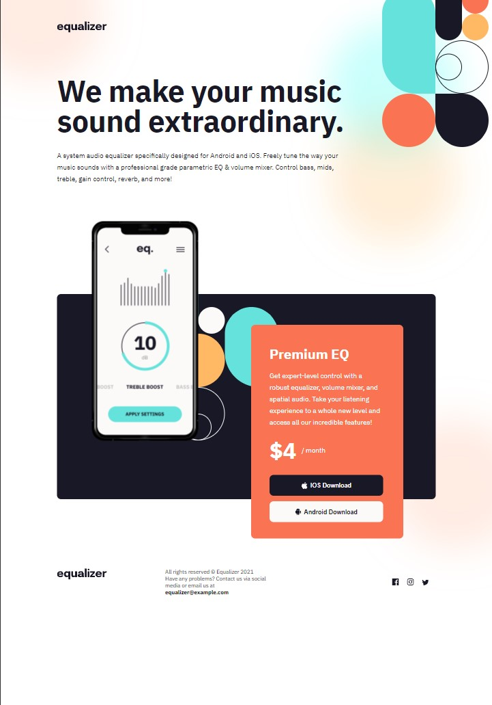
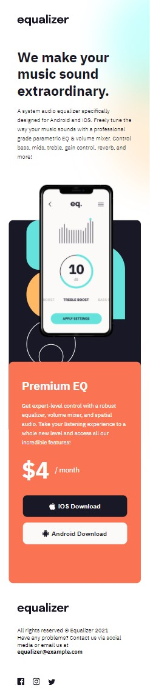

# Frontend Mentor - Equalizer landing page solution

This is a solution to the [Equalizer landing page challenge on Frontend Mentor](https://www.frontendmentor.io/challenges/equalizer-landing-page-7VJ4gp3DE). Frontend Mentor challenges help you improve your coding skills by building realistic projects.

## Table of contents

- [Overview](#overview)
  - [The challenge](#the-challenge)
  - [Screenshot](#screenshot)
- [My process](#my-process)
  - [Built with](#built-with)
- [Author](#author)
- [Acknowledgments](#acknowledgments)

## Overview

### The challenge

Users should be able to:

- View the optimal layout depending on their device's screen size
- See hover states for interactive elements

### Screenshot

### Links

- Solution URL: [Front End Mentor Solution](https://www.frontendmentor.io/solutions/equalizer-landing-page-ZeW6G_W-o)
- Live Site URL: [Hosted on Github](https://chris971991.github.io/equalizer-landing-page/)

## My process

### Built with

- Microsoft Edge
- VS Code
- Semantic HTML5 markup
- CSS custom properties
- Media Queries
- Flexbox & Grid
- SCSS (Sass)

## Author

- Website - [Christopher Carruthers](https://github.com/Chris971991)
- Frontend Mentor - [@Chris971991](https://www.frontendmentor.io/profile/Chris971991)

## Acknowledgments

I would like to put a word out for all the devs at Front End Mentor and thank them for creating a platform for people who want a challenge whilst learning Web Developement.
